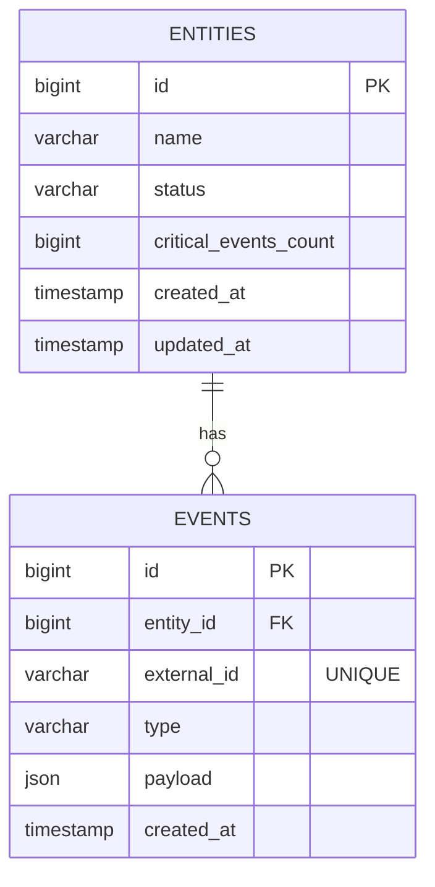

# Holocron Sentinel

API backend para monitoramento de entidades estratégicas e seus eventos, com foco em **concorrência**, **idempotência** e **performance em alto volume de dados**.

Este projeto foca exclusivamente no backend, não possuindo interface de frontend.


<br>

---

<br>


## Contexto

O Holocron Sentinel é um sistema fictício utilizado para monitorar entidades relevantes da Aliança Rebelde, como planetas, bases ou naves estratégicas.

Cada entidade pode receber eventos que representam atividades rotineiras ou ameaças críticas. Eventos críticos impactam diretamente o estado da entidade e podem levá-la à suspensão automática.

O sistema foi projetado considerando:

- alto volume de dados
- múltiplas requisições simultâneas
- consistência sob concorrência

<br>

---

<br>

## Modelo de Domínio

### Entidade Monitorada (`entities`)

- representa algo que deve ser continuamente observado
- inicia sempre com status `active`
- pode ser suspensa automaticamente ao atingir um limite de eventos críticos
- não aceita novos eventos quando suspensa

Campos principais:

- `id`
- `name`
- `status` (`active`, `suspended`)
- `critical_events_count`
- `created_at`
- `updated_at`

<br>

---

<br>

### Evento (`events`)

- representa uma ocorrência associada a uma entidade
- pertence obrigatoriamente a uma entidade monitorada
- é identificado externamente por um `external_id` (idempotência)
- eventos do tipo `critical` impactam o estado da entidade

Campos principais:

- `id`
- `entity_id`
- `external_id` (único)
- `type` (`info`, `warning`, `critical`)
- `payload` (JSON)
- `created_at`

Relacionamento:

```
entities (1) ──────────────── (N) events
```

<br>

---

<br>

## Modelo de Dados (ERD)



<br>

---

<br>

## Decisões Técnicas

### Idempotência

- Garantida no **nível do banco de dados** através de índice único em `events.external_id`
- Evita processamento duplicado mesmo sob múltiplas requisições simultâneas

### Concorrência e Consistência

- Operações críticas são executadas dentro de **transações**
- Processamento assíncrono de eventos críticos via **Jobs/Queues** para reduzir locks no banco
- A entidade monitorada é bloqueada apenas quando necessário (`SELECT … FOR UPDATE`)
- Garante consistência entre:
  - criação do evento (síncrono para idempotência)
  - incremento do contador de eventos críticos (assíncrono via Job)
  - possível suspensão automática da entidade (assíncrono)

### Performance

- **Processamento assíncrono**: Eventos críticos são processados em background via Jobs, reduzindo drasticamente o tempo de lock na requisição HTTP
- **Cache**: Listagens e rankings são cacheados para reduzir consultas ao banco
  - Cache de listagem: 5 minutos
  - Cache de ranking: 2 minutos
- Uso de índices direcionados para:
  - agregações
  - filtros temporais
  - ranking de eventos críticos (índice composto `[entity_id, type, created_at]`)
- Queries agregadas para evitar problemas de **N+1**
- Contador de eventos críticos mantido de forma denormalizada para otimizar leituras

<br>

---

<br>

## Endpoints da API

### Criar entidade monitorada

**POST** `/api/entities`

```json
{
  "name": "Hoth Base"
}
```

### Listar entidades monitoradas

**GET** `/api/entities`

Retorna, para cada entidade:

- dados básicos
- total de eventos associados
- total de eventos críticos
- data do último evento registrado

### Registrar evento para uma entidade

**POST** `/api/entities/{entityId}/events`

```json
{
  "external_id": "abc-123",
  "type": "critical",
  "payload": {
    "source": "probe"
  }
}
```

Comportamento:

- idempotente via `external_id`
- rejeita eventos para entidades suspensas, retornando erro de negócio (ex.: **409 Conflict**)
- suspende automaticamente a entidade ao atingir o limite configurado de eventos críticos

### Ranking de entidades críticas

**GET** `/api/entities/ranking/critical?days=7&limit=10`

Retorna as entidades com mais eventos críticos no período informado, ordenadas do mais crítico para o menos crítico.

<br>

---

<br>

## Testes

- Testes de integração localizados em `tests/Feature`
- Validação das regras de negócio, não apenas de status HTTP
- Cobertura de cenários como:
  - idempotência de eventos
  - suspensão automática de entidades
  - consistência sob concorrência

<br>

---

<br>

## Executando o projeto

O projeto pode ser executado via Docker Compose.

Passos gerais:

```bash
docker compose up -d
docker compose exec app php artisan migrate
docker compose exec app php artisan test
```

**Importante**: Para processar eventos críticos de forma assíncrona, é necessário executar o worker de filas:

```bash
docker compose exec app php artisan queue:work --queue=critical-events,default
```

Ou em produção, configure um supervisor/systemd para manter o worker rodando continuamente.

As configurações de banco e containers estão descritas no `docker-compose.yml`.

<br>

---

<br>

## Arquitetura Assíncrona

Regras de negócio permanecem **síncronas** (consistência forte); apenas invalidação de cache/agregados é **assíncrona**. Ver `ASYNC_ARCHITECTURE.md`.

### Fluxo de Criação de Eventos

1. **Requisição HTTP**: Cria o evento de forma síncrona (idempotência por `external_id`)
2. **Eventos críticos**: Contador e suspensão são atualizados **na mesma requisição** (transação com `lockForUpdate()`)
3. **Job assíncrono**: `InvalidateEventCachesJob` é enfileirado para invalidar caches de listagem e ranking
4. **Worker**: Processa o job em background (sem regras de negócio)

### Cache

- **Listagem de entidades**: Cache de 5 minutos; invalidado pelo job após criação de evento
- **Ranking crítico**: Cache de 2 minutos; invalidado pelo job quando o evento é crítico

### Configuração de Filas

Por padrão, o sistema usa filas do banco de dados (`QUEUE_CONNECTION=database`). Para produção, considere:

- **Redis**: Melhor performance para filas
- **RabbitMQ/SQS**: Para ambientes distribuídos
- **Supervisor**: Para manter workers rodando continuamente

## Possíveis Evoluções em Produção

- ~~Cache de agregações e rankings~~ ✅ Implementado
- Views materializadas ou tabelas de consolidação
- Particionamento da tabela de eventos
- Observabilidade (logs estruturados, métricas, tracing)
- Estratégias de retry e circuit breaker
- Monitoramento de filas e jobs

<br>

---

<br>

## Stack

- PHP 8+
- Laravel
- Banco relacional (PostgreSQL)
- Docker / Docker Compose
